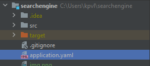
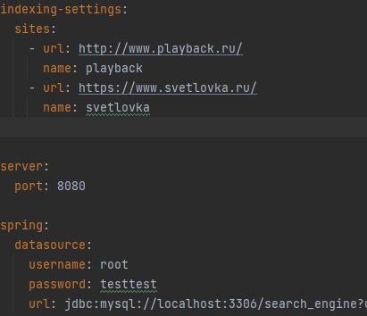
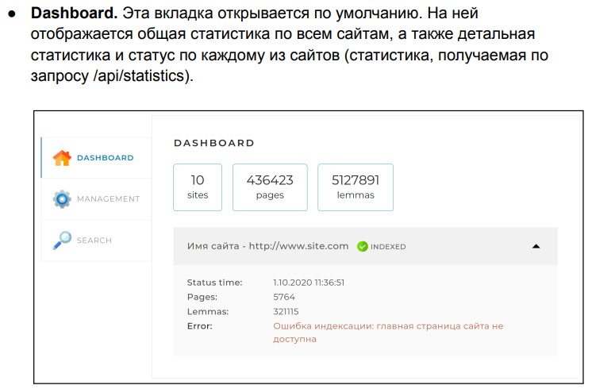
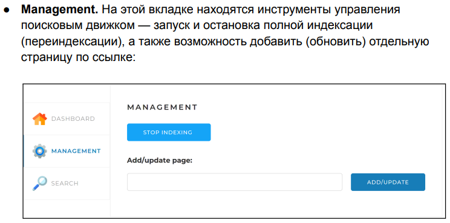
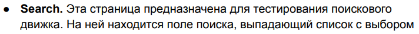
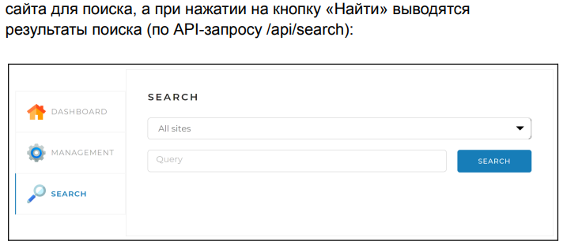

                                  Поисковый движок по сайтам.
Перед запуском приложения в файле application.yaml в indexing-settings 
пропишите url и name сайтов, которые планируете индексировать. В файле application.yaml введите свои данные 
для БД MySQL "username, password, url".

Запустите приложение и откройте его через браузер по адресу: http://localhost:8080/.

Индексакция сайтов осуществляется в многопоточном режиме с использованием ForkJoinPool.

